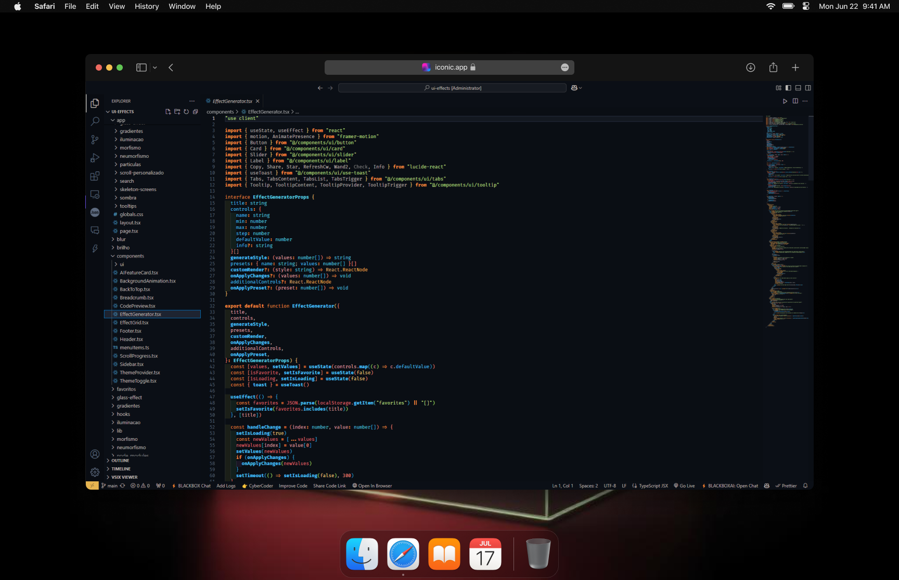

# Tema Black Box

Você pode baixar o Tema Black Box no Marketplace do Visual Studio: [Tema Black Box](https://marketplace.visualstudio.com/items?itemName=Aquinogui.blackbox-theme).

Este tema oferece uma aparência elegante e moderna para o seu editor de código, melhorando a legibilidade e o foco.

## Instruções de Instalação

1. **Baixe o Tema**: 
   - Clone ou faça o download do repositório para sua máquina local.

   ## Visualização


2. **Instale as Dependências**: 
   - Navegue até o diretório do tema no seu terminal e execute:
     ```
     npm install
     ```

3. **Adicione a Imagem**: 
   - Coloque sua imagem de capa no diretório `images` e certifique-se de que ela esteja nomeada como `capa.png`.

4. **Ative o Tema**: 
   - Siga as instruções específicas para sua plataforma para ativar o tema.


## Valor Adicionado
O tema Black Box foi projetado para oferecer uma experiência visual moderna e elegante, melhorando a estética do seu projeto. Com instruções simples e diretas, você pode personalizar sua interface rapidamente, tornando seu trabalho mais agradável e eficiente.